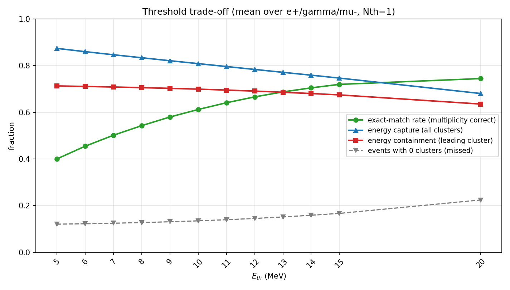
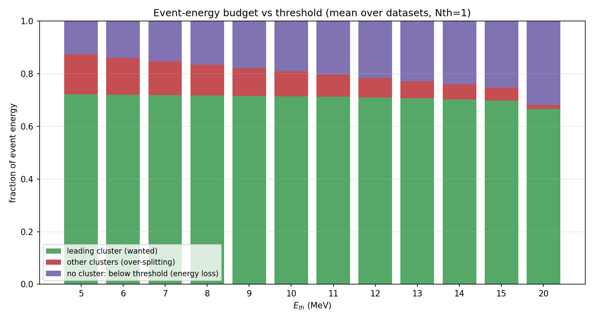
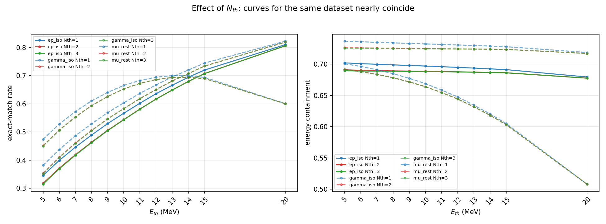
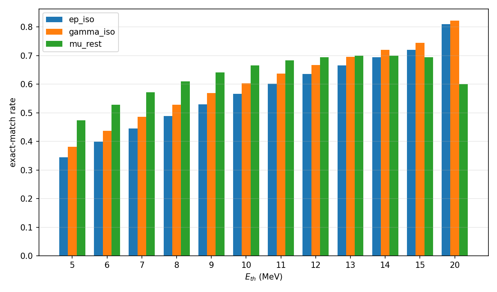

# 参数扫描总结 —— ECAL 聚类重建目前的表现

> 本文由参数扫描自动产出，与 `pytrial/results/sweep/` 下的 CSV / 图表配套。
> 扫描代码：`pytrial/sweeps/{config,prepare_subsets,run_task,run_sweep,analyze}.py`
> 数据：`data/processed/edep_of_each_evt_{ep_iso,gamma_iso,mu_rest}.root`（各 1,000,000 事件，取前 50,000 做扫描）

---

## 0. 一句话结论

**框架是通的，但算法目前被"一个全局能量阈值"卡住了。** `Eth` 同时承担了"抑制噪声/防止过度分裂"和"尽量收住簇内能量"两个互相矛盾的任务：把 `Eth` 调高，簇多重数会越来越准（exact match 从 0.40 → 0.82），但事件能量里落在簇外的比例也从 12% 涨到 28–41%。**不存在一个 `Eth` 能同时把两件事做好**——这正是当前"框架期"最需要靠算法细节（分裂 / 能量共享 / 噪声显著度）而不是靠调参解决的问题。

---

## 1. 扫描设置

| 项目 | 内容 |
|:--|:--|
| 数据集 | `ep_iso`（e⁺）、`gamma_iso`（γ）、`mu_rest`（μ⁻），各 50,000 事件 |
| 参数网格 | `Eth` ∈ {5, 6, 7, 8, 9, 10, 11, 12, 13, 14, 15, 20} MeV × `Nth` ∈ {1, 2, 3} |
| 扫描点数 | 12 × 3 × 3 = **108**，全部成功（336 s，18 进程并行） |
| 真值 | 单粒子事例 → 每事例期望 1 个簇（`expected_lambda = 1`） |
| 算法 | `pytrial/reconstruction.py`（能量降序选种 → 波前传播 → 二阶邻居 gap-jumping，`n_fallback_chance=1`） |
| 顶点拓扑 | `data/utilities/ecal_neighbor_info_added.root`（622 模块；数据向量 568，按原设计补零） |

复现方式：

```bash
cd pytrial
ECAL_SWEEP_N_EVENTS=50000 python3 sweeps/prepare_subsets.py   # 生成子样本
ECAL_SWEEP_N_EVENTS=50000 python3 sweeps/run_sweep.py --force # 108 个点
python3 sweeps/analyze.py                                     # 出图 + 汇总表
```

### 指标定义

| 指标 | 含义 |
|:--|:--|
| `exact_match_rate` | 簇数恰好 = 1 的事例比例（多重数正确率） |
| `frac_0` | 0 个簇的事例比例（漏检） |
| `frac_2`, `frac_3plus` | 2 个簇 / ≥3 个簇（过度分裂） |
| `MAE` | `mean(\|n_clusters − 1\|)` |
| `energy_containment_mean` | 最大簇能量 / 事例总能量（**主簇能量收束率**） |
| `energy_captured_fraction` | 所有簇能量之和 / 事例总能量（**能量捕获率**） |
| `energy_split_fraction` | 落在非主簇里的能量比例（**分裂损失**） |
| `energy_unclustered_fraction` | 未进入任何簇的能量比例（**阈值损失**） |

> 新增的能量类指标是关键：只看簇多重数无法区分"过度分裂"与"能量泄漏"，两者需要分开量化。

---

## 2. 与既有 1M 事件结果的一致性校验

用 50k 子样本复现 `pytrial/results/Eth10_Nth{1,2}/summary.md` 里记录的 1M 事件结果：

| 数据集 | 配置 | 本次 mean | 文档 mean | 本次 1-cluster | 文档 1-cluster |
|:--|:--|--:|--:|--:|--:|
| ep_iso | Eth=10, Nth=1 | 1.219 | 1.217 | 0.567 | 0.566 |
| gamma_iso | Eth=10, Nth=1 | 1.164 | 1.161 | 0.604 | 0.601 |
| mu_rest | Eth=10, Nth=1 | 1.016 | 1.016 | 0.666 | 0.664 |
| ep_iso | Eth=10, Nth=2 | 1.246 | 1.244 | 0.544 | 0.544 |
| gamma_iso | Eth=10, Nth=2 | 1.187 | 1.184 | 0.583 | 0.581 |
| mu_rest | Eth=10, Nth=2 | 1.030 | 1.030 | 0.653 | 0.651 |

**偏差 ≤0.4%**，说明扫描链路与历史结论自洽，50k 子样本对该量级的比较已足够。

---

## 3. 核心发现：`Eth` 把"多重数"和"能量"绑成了零和



以 `Nth=1`、三个数据集平均为例：

| `Eth` (MeV) | exact match ↑ | 能量捕获率 ↑ | 主簇收束率 ↑ | 漏检 frac₀ ↓ |
|--:|--:|--:|--:|--:|
| 5 | 0.400 | 0.874 | 0.713 | 0.121 |
| 9 | 0.580 | 0.821 | 0.703 | 0.131 |
| 10 | 0.612 | 0.809 | 0.699 | 0.135 |
| 13 | 0.687 | 0.771 | 0.686 | 0.152 |
| 15 | 0.720 | 0.747 | 0.675 | 0.167 |
| 20 | 0.745 | 0.681 | 0.635 | 0.224 |

两条曲线单调反向：**为了把簇数压到 1，代价是把越来越多的能量丢在阈值以下。**

逐数据集（`Nth=1`，节选）：

| 数据集 | `Eth` | mean | frac₀ | frac₁ | frac₂ | frac₃₊ | exact | MAE | 收束率 | 捕获率 | 分裂损失 | 阈值损失 |
|:--|--:|--:|--:|--:|--:|--:|--:|--:|--:|--:|--:|--:|
| ep_iso | 5 | 1.571 | 0.117 | 0.345 | 0.400 | 0.137 | 0.345 | 0.805 | 0.702 | 0.879 | 0.165 | 0.121 |
| ep_iso | 10 | 1.219 | 0.118 | 0.567 | 0.292 | 0.023 | 0.567 | 0.456 | 0.697 | 0.821 | 0.111 | 0.179 |
| ep_iso | 15 | 1.037 | 0.122 | 0.720 | 0.157 | 0.001 | 0.720 | 0.281 | 0.691 | 0.769 | 0.064 | 0.231 |
| ep_iso | 20 | 0.907 | 0.141 | 0.811 | 0.048 | 0.000 | 0.811 | 0.189 | 0.679 | 0.717 | 0.023 | 0.283 |
| gamma_iso | 5 | 1.492 | 0.123 | 0.381 | 0.383 | 0.112 | 0.381 | 0.739 | 0.737 | 0.885 | 0.148 | 0.115 |
| gamma_iso | 10 | 1.164 | 0.124 | 0.604 | 0.256 | 0.016 | 0.604 | 0.412 | 0.732 | 0.829 | 0.096 | 0.171 |
| gamma_iso | 15 | 1.004 | 0.126 | 0.745 | 0.129 | 0.001 | 0.745 | 0.256 | 0.728 | 0.782 | 0.053 | 0.218 |
| gamma_iso | 20 | 0.897 | 0.140 | 0.823 | 0.037 | 0.000 | 0.823 | 0.177 | 0.719 | 0.739 | 0.018 | 0.261 |
| mu_rest | 5 | 1.356 | 0.122 | 0.474 | 0.335 | 0.069 | 0.474 | 0.600 | 0.700 | 0.858 | 0.144 | 0.142 |
| mu_rest | 10 | 1.016 | 0.162 | 0.666 | 0.166 | 0.006 | 0.666 | 0.340 | 0.669 | 0.776 | 0.076 | 0.224 |
| mu_rest | 15 | 0.800 | 0.253 | 0.694 | 0.053 | 0.000 | 0.694 | 0.306 | 0.605 | 0.689 | 0.029 | 0.311 |
| mu_rest | 20 | 0.615 | 0.392 | 0.601 | 0.007 | 0.000 | 0.601 | 0.399 | 0.508 | 0.586 | 0.005 | 0.414 |

极端点值得注意：`Eth=20` 时 `mu_rest` 有 **39% 的事例一个簇都建不出来**，近 **41% 的能量完全没进簇**。

---

## 4. 能量到底去哪了



把事例总能量拆成三份（三数据集平均，`Nth=1`；按"能量求和之比"分解，三份严格加起来 = 1）：

| `Eth` | 主簇（想要的） | 其它簇（过度分裂） | 未入簇（阈值损失） |
|--:|--:|--:|--:|
| 5 | 0.722 | 0.152 | 0.126 |
| 10 | 0.714 | 0.095 | 0.191 |
| 15 | 0.698 | 0.049 | 0.253 |
| 20 | 0.666 | 0.015 | 0.319 |

> 口径说明：本表的"主簇"= `energy_captured_fraction − energy_split_fraction`（能量求和之比）。
> 第 3 节热图/曲线里的 `energy_containment_mean` 是**逐事例比值再取平均**，两者相差 ≤0.02（例如 Eth=5 时 0.722 vs 0.713），属正常口径差异。

两个结构性问题一眼可见：

1. **即使把阈值压到 5 MeV，仍有 ~12% 的能量在阈值以下，永远进不了任何簇。** 这部分能量对 622 个晶体是硬损失——单靠调 `Eth` 无法回收。
2. **调高 `Eth` 并不能把能量"还给主簇"，只是把损失从"分裂"换成了"未入簇"。** 分裂损失 0.152 → 0.015 的同时，阈值损失 0.126 → 0.319。

换句话说：当前算法没有任何机制把已经沉积、但低于阈值的能量归拢回主簇（没有局部极大值分裂、没有簇间能量共享、没有簇能量修正）。

---

## 5. `Nth` 几乎没有作用



把整个网格上 `Nth=1` 与 `Nth=3` 逐点相减：

| 指标 | max\|N1−N3\| | mean\|N1−N3\| |
|:--|--:|--:|
| exact_match_rate | 0.031 | 0.018 |
| energy_containment_mean | 0.013 | 0.007 |
| mean_clusters | 0.058 | 0.023 |
| MAE | 0.058 | 0.023 |

结论与 `requirement.md` NO.5/NO.6 一致：**`Nth` 是弱参数**，在 1–3 范围内对结果的影响远小于 `Eth`。它更像是一个"防串扰的补丁"，而不是一个物理旋钮。这也说明当前"统计已点亮邻居数"的传播判据信息量偏低。

---

## 6. 三种粒子的行为差异



| 数据集 | 事例总能量中位数 | 最优 exact | 最优 收束率 | 高 `Eth` 行为 |
|:--|--:|:--|:--|:--|
| gamma_iso | ~53 MeV | **0.823** @ Eth=20, Nth=1 | 0.737 @ Eth=5 | 最稳健 |
| ep_iso | ~54 MeV | 0.811 @ Eth=20, Nth=1 | 0.702 @ Eth=5 | 稳健 |
| mu_rest | ~36 MeV | 0.700 @ Eth=13, Nth=1 | 0.700 @ Eth=5 | **高阈值下崩溃** |

μ⁻ 是 MIP，能量沉积少而分散；事例总能量中位数只有 36 MeV，而扫描的最高阈值是 20 MeV——**阈值已经和信号本身同量级**，所以 `Eth≥15` 后 μ 事例被整片切掉。这正说明"全局固定阈值"对粒子种类没有适应性。

---

## 7. 那个 ~12% 的"零簇地板"不是算法缺陷

三份样本中都有 **11–12% 的事例，ECAL 总沉积能量 < 1 MeV**（基本等于没有打到量能器）：

| 数据集 | P(E_tot < 1 MeV) | P(E_tot < 5 MeV) | P(E_tot < 10 MeV) |
|:--|--:|--:|--:|
| ep_iso | 0.113 | 0.117 | 0.118 |
| gamma_iso | 0.122 | 0.123 | 0.123 |
| mu_rest | 0.110 | 0.117 | 0.130 |

因此 `frac_0` 存在一个**接受度地板**，`exact_match_rate` 的理论上限也不是 1，而是 `1 − P(E_tot<1 MeV) ≈ 0.88`。做接受度修正后（`exact / (1 − floor)`，`Nth=1`）：

| 数据集 | Eth=5 | Eth=10 | Eth=15 | Eth=20 |
|:--|--:|--:|--:|--:|
| ep_iso | 0.389 | 0.639 | 0.812 | **0.914** |
| gamma_iso | 0.434 | 0.688 | 0.849 | **0.937** |
| mu_rest | 0.533 | 0.748 | 0.780 | 0.675 |

这一点很重要：**不修正接受度会系统性低估算法性能**，也会让不同数据集之间的比较失真。建议后续把"有效事例"定义为 `E_tot > 阈值` 再算多重数指标。

---

## 8. 统计检验的说明（附带一个方法学警告）

扫描对每个点都算了 `χ²/ndf` 与 KS（对照 Poisson(1)）：

| 数据集 | Eth=10 χ²/ndf | KS D |
|:--|--:|--:|
| ep_iso | 3832 | 0.617 |
| gamma_iso | 3930 | 0.611 |
| mu_rest | 4267 | 0.574 |

两点必须说清楚：

1. **Poisson(1) 只是方便的参考分布，不是物理模型。** 真实分布带一个 ~12% 的接受度尖峰（0 簇）和一个被阈值塑造出的多重数尾巴，因此全部点都以极大的 χ² 拒绝 Poisson——这个"拒绝"没有诊断价值。
2. **`scipy.stats.kstest(data, "poisson")` 对离散分布做 KS 检验在统计上是不成立的**（KS 的 p 值假设连续分布），这里的 p 值只能当描述性数字，不能当显著性结论。若要保留 GOF，应改用离散分布专用的检验。

建议把评价体系整体换成基于真值的**能量加权 V-score（homogeneity/completeness 的调和平均）+ splitting rate**，详见第 10 节与改进建议文档。

---

## 9. 当前算法处于什么水平

**已经成立的（框架期成果）**

- 波前传播 + 能量降序选种这条主干是有效的：多重数分布随 `Eth` 单调、可控，`mean_clusters` 能扫到 1.0 附近。
- 结果可复现（50k 与 1M 一致到 0.4%），扫描链路稳定。
- 单粒子样本上，调好的工作点已经能让 **60–82% 的事例簇数恰好为 1**。

**还没解决的（细节期任务）**

| 现象 | 直接证据 | 缺失的机制 |
|:--|:--|:--|
| 过度分裂 | `Eth=5` 时 54% 的事例 ≥2 簇，分裂损失 15% 能量 | 局部极大值分裂 / 一个连通区对应一个种子 |
| 阈值能量损失 | `Eth=5` 时仍有 12% 能量在阈值下；`Eth=20` 达 28–41% | 噪声显著度阈值、簇能量修正、泄漏回收 |
| 簇间无能量共享 | 每个晶体只能属于一个簇 | 距离加权/高斯分数的能量共享 |
| `Nth` 近乎无用 | `Nth` 1→3 只改变 1.8% exact | 更有信息量的传播判据（显著度、方向、时间） |
| 无法区分粒子种类 | μ 在高阈值下崩溃 | 簇形状变量（横向矩）、时间、径迹匹配 |
| 评价指标不完备 | 只看簇数，不看能量归属 | 能量加权 V-score + splitting rate |

**工作点建议**

- 若目标只是"簇多重数尽量准"：`Eth ≈ 15–20, Nth = 1`（但能量代价不可接受）。
- 若要在**多重数与能量之间取平衡**：`Eth ≈ 10–12, Nth = 1` 是当前框架下的合理默认（`Eth=10,Nth=1` 时 exact≈0.61、捕获率≈0.81）。
- **但不建议继续在阈值上找"最优"**：第 3、4 节已证明这是零和权衡。下一步收益来自算法机制，而不是参数。

---

## 10. 图表索引（均在 `pytrial/results/sweep/`）

| 文件 | 内容 |
|:--|:--|
| `heatmap_exact_match.png` | 三个数据集 + 平均：exact match 的 `Eth×Nth` 热图 |
| `heatmap_energy_containment.png` | 主簇能量收束率热图 |
| `heatmap_energy_captured.png` | 能量捕获率热图 |
| `heatmap_energy_unclustered.png` | 阈值损失热图 |
| `heatmap_mean_clusters.png` | 平均簇数热图（真值 = 1） |
| `heatmap_mae.png` | MAE 热图 |
| `tradeoff_nth1.png` / `tradeoff_nth2.png` | **核心结论图**：多重数质量 vs 能量质量 |
| `energy_budget_nth1.png` / `energy_budget_nth2.png` | 事例能量去向分解 |
| `nth_effect.png` | `Nth` 影响极小 |
| `trend_exact_match.png` / `trend_energy_containment.png` / `trend_mean_clusters.png` / `trend_missed_events.png` | 逐数据集趋势曲线 |
| `composition_nth1.png` / `composition_nth2.png` | 0/1/2/≥3 簇的成分随 `Eth` 变化 |
| `compare_datasets_exact_match.png` | 三种粒子对比 |
| `sweep_summary.csv` | 108 行完整指标（可直接再分析） |
| `best_params.md` | 各指标最优点 + 网格排序 |

---

## 11. 给下一步的接口

本文只回答"现在有多好、卡在哪里"。**具体该补哪些算法机制、参考哪些实验的哪些做法（含论文链接与原文片段），见 `docs/algorithm_improvement_proposals.md`。**
